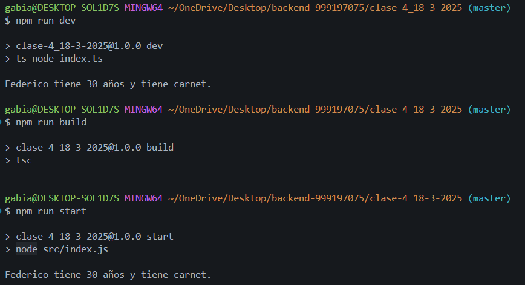

# Markdown

Markdown es un lenguaje de marcado ligero creado por John Gruber y Aaron Swartz que trata de conseguir la máxima legibilidad y facilidad de publicación tanto en su forma de entrada como de salida, inspirándose en muchas convenciones existentes para marcar mensajes de correo electrónico usando texto plano. 

# Javascritp

- Lenguaje Interpretado: No necesita compilación previa, se ejecuta directamente en el navegador o en un entorno como Node.js.
- Basado en Prototipos: Usa prototipos en lugar de clases para la herencia y reutilización de código.
- Tipado Dinámico: No es necesario declarar el tipo de una variable, este se asigna en tiempo de ejecución.
- Orientado a Objetos: Soporta objetos y programación orientada a objetos con prototipos y clases (desde ES6).
- Multiparadigma: Permite programación estructurada, orientada a objetos y funcional.
- Asincronía y Event Loop: Soporta programación asincrónica con setTimeout, setInterval, Promesas y async/await.
- Ejecución en el Navegador: Es el lenguaje principal para la programación en el lado del cliente en la web.
- Compatibilidad con JSON: Facilita la manipulación y transmisión de datos con formato JSON.
- Alta Interoperabilidad: Puede integrarse fácilmente con HTML, CSS y diversas APIs del navegador.
- Soporte para Módulos: A partir de ES6, permite la importación y exportación de módulos (import/export).
- Manipulación del DOM: Permite modificar dinámicamente el contenido y estilo de las páginas web.
- Event-Driven: Funciona mediante eventos, lo que facilita la interactividad con el usuario.
- Extensible con Bibliotecas y Frameworks: Existen muchas bibliotecas y frameworks como React, Vue, Angular y jQuery.
- Compatible con Node.js: Puede ejecutarse en el servidor para desarrollo backend.
Ecosistema Activo: Cuenta con una gran comunidad y un vasto repositorio de paquetes en npm.

## Iniciar proyectos

- javascript (node): npm init -y
- typescript: tsc --init

## Consigna ejercicio en clase

### Definir la interfaz Tarea
**Define la estructura básica de una tarea.**
Asegúrate de que la interfaz tenga los siguientes campos:
id: Un número único para identificar cada tarea.
titulo: Una cadena de texto que representa el título de la tarea.
completada: Un valor booleano que indica si la tarea ha sido completada.
2. Crear la clase GestorTareas
Define la clase GestorTareas que gestionará las tareas.
Dentro de la clase, crea un arreglo privado tareas que almacenará las tareas.
3. Implementar el método agregarTarea
Este método recibirá un título como parámetro y creará una nueva tarea.
La tarea tendrá:
Un id basado en la longitud actual del arreglo tareas + 1 (para garantizar que el id sea único).
El titulo que se pasa como parámetro.
La propiedad completada inicializada a false.
Agrega la nueva tarea al arreglo tareas.
4. Implementar el método listarTareas
Este método no recibe parámetros.
Utiliza console.log para imprimir todas las tareas almacenadas en el arreglo tareas.
5. Implementar el método completarTarea
Este método recibirá un id como parámetro.
Busca la tarea con ese id en el arreglo tareas.
Si la tarea se encuentra, cambia su propiedad completada a true.
6. Instanciar la clase GestorTareas
Crea una nueva instancia de la clase GestorTareas para gestionar las tareas.
7. Agregar tareas utilizando agregarTarea
Llama al método agregarTarea para agregar varias tareas, como "Aprender TypeScript" y "Practicar ejercicios".
8. Listar las tareas con listarTareas
Llama al método listarTareas para imprimir las tareas antes y después de completar alguna.
9. Completar una tarea usando completarTarea
Llama al método completarTarea pasando el id de la tarea que deseas marcar como completada (por ejemplo, id = 1).
10. Verificar el resultado
Llama nuevamente al método listarTareas para ver cómo se han actualizado las tareas, verificando que la tarea completada tenga la propiedad completada: true.